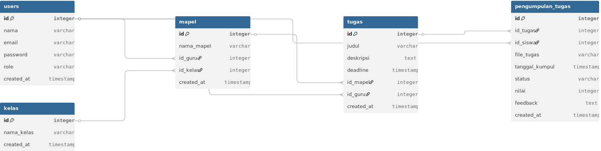
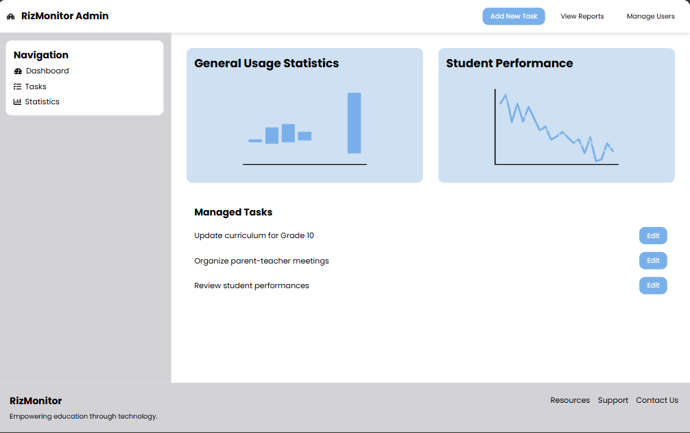
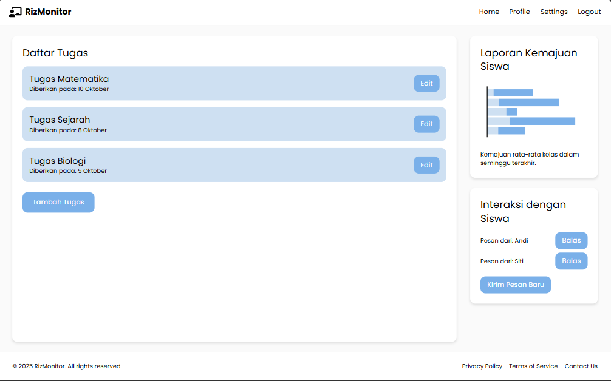
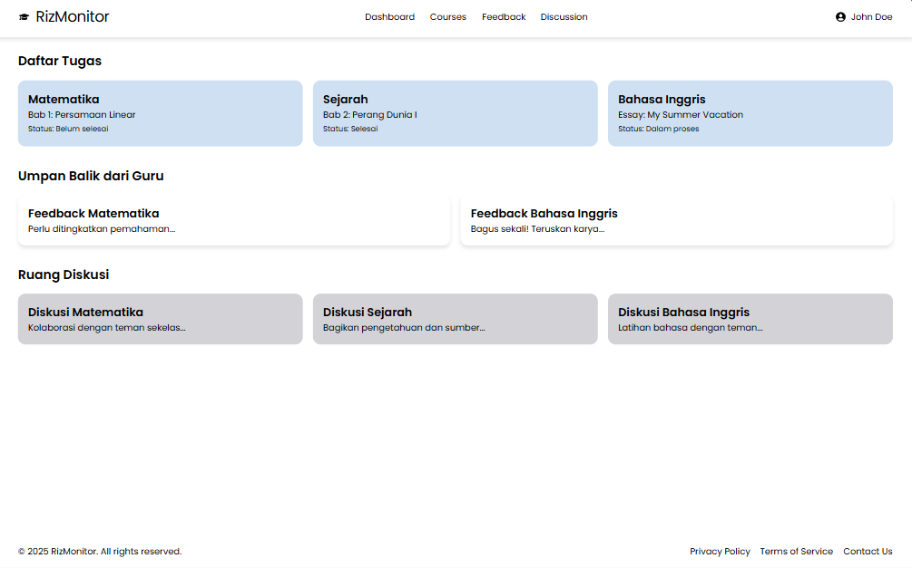

📚 Web Monitoring Tugas

Aplikasi web untuk memantau, mengelola, dan menilai tugas sekolah. Sistem ini menghubungkan Admin, Guru, dan Siswa dalam satu platform yang terintegrasi, sederhana, dan efisien.

👥 Role & Fitur
🛠️ Admin
- 🔑 Kelola akun pengguna (Guru & Siswa)
- 🏫 Atur data kelas & mata pelajaran
- 📊 Pantau statistik pengumpulan tugas

👨‍🏫 Guru

- ✍️ Membuat & membagikan tugas
- 📂 Melihat daftar pengumpulan siswa
- ✅ Memberikan nilai & feedback

👨‍🎓 Siswa
- 📋 Melihat daftar tugas & deadline
- 📤 Upload / update hasil tugas
- 📨 Mengecek status & komentar dari guru

⚙️ Teknologi yang Digunakan
Backend : PHP (Native)
Database : MySQL
Frontend : HTML, CSS (TailwindCSS), JavaScript
Opsional : Bootstrap / jQuery

🚀 Instalasi Lokal
Clone repository ini
git clone https://github.com/rizkiram123/Web-Monitoring.git
cd Web-Monitoring

Import database dari file .sql ke MySQL

Atur konfigurasi database di file config.php

Jalankan di browser melalui http://localhost/nama-repo

🗂️ Dokumentasi Sistem

📌 ERD / Database Diagram

📌 Use Case Diagram

📌 Activity Diagram

📌 Flowchart

🖥️ Tampilan Antarmuka
🔐 Halaman Login

📊 Dashboard Admin

📌 Dashboard Guru

📚 Dashboard Siswa

✨ Fitur Utama
✔️ Multi-role (Admin, Guru, Siswa)
✔️ Monitoring tugas real-time
✔️ Nilai & feedback langsung dari guru
✔️ Tampilan dashboard sederhana & responsif
